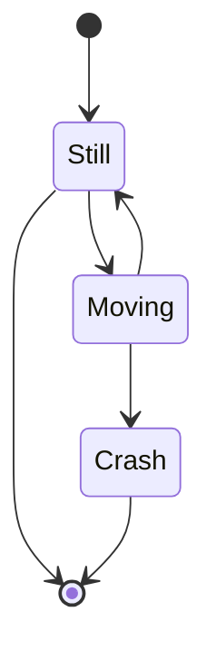

# GitHub-Markdown
```

```

```
[![issues][0]][1]

[0]: https://img.shields.io/github/issues/DuncanFH/GitHub-Markdown
[1]: https://github.com/DuncanFH/GitHub-Markdown/issues
```

[![issues][0]][1]

[0]: https://img.shields.io/github/issues/DuncanFH/GitHub-Markdown
[1]: https://github.com/DuncanFH/GitHub-Markdown/issues
?Label= Example Label

## CODE and Rendered View
```text
  ```mermaid
  stateDiagram
      [*] --> Still
      Still --> [*]

      Still --> Moving
      Moving --> Still
      Moving --> Crash
      Crash --> [*]
 ``` 

|

|


