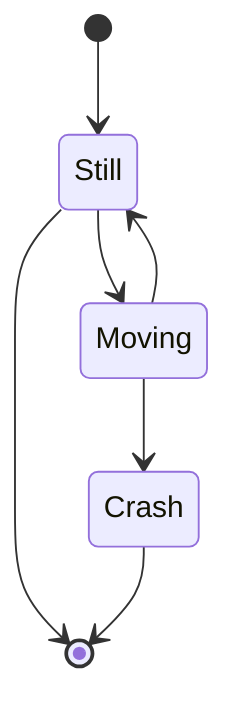

# GitHub-Markdown
```

```

```
[![issues][0]][1]

[0]: https://img.shields.io/github/issues/DuncanFH/GitHub-Markdown
[1]: https://github.com/DuncanFH/GitHub-Markdown/issues
```

[![issues][0]][1]

[0]: https://img.shields.io/github/issues/DuncanFH/GitHub-Markdown
[1]: https://github.com/DuncanFH/GitHub-Markdown/issues
?Label= Example Label

## CODE and Rendered View
```text
  ```mermaid
  stateDiagram
      [*] --> Still
      Still --> [*]

      Still --> Moving
      Moving --> Still
      Moving --> Crash
      Crash --> [*]
 ``` 

|

|


### Properly merge and close this branch via _Pull Request_ :octocat: label:123

| BRANCH | `implement-powertrack-driver` |
| :---  |:--- |
| NOTES | more documented found in Issue #7 |
| JIRA | [AACD-3657](https://jira.nov.com/browse/AACD-3657) Implement PowerTrack Driver |
 | NOTES | more documented found in Issue #7 |
| NOTES | more documented found in Issue #7 |

This is some text[^1] with a footnote reference link.
[^1]: "This is a footnote"

[^2 "This is an inline footnote"]


Per the **ACTU Repo Cleanup** meeting on Teams today, this branch (and a few others) were discussed and determined to require being "merged and closed" via pull request, since the previous branch merges (e.g. #13) were not appearing in the _Network Graph_ ([linked here](https://github.com/NationalOilwellVarco/aacd-ctrl-smartcoil/network)).

| --- | --- |
| baz | bim |


Attendees:
1. James Belcher (@belcherjy)
2. Mark Chandler (@markdchandler)
3. Franklin Duncan (@DuncanFH)
4. Konstantin Gavrikov(@gavrikovk)
5. Jinbing Wu (@jw-nov)
6. Charleston Vinitski (@VinitskiC)
